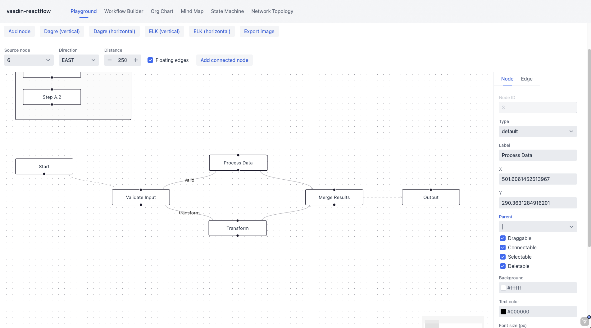
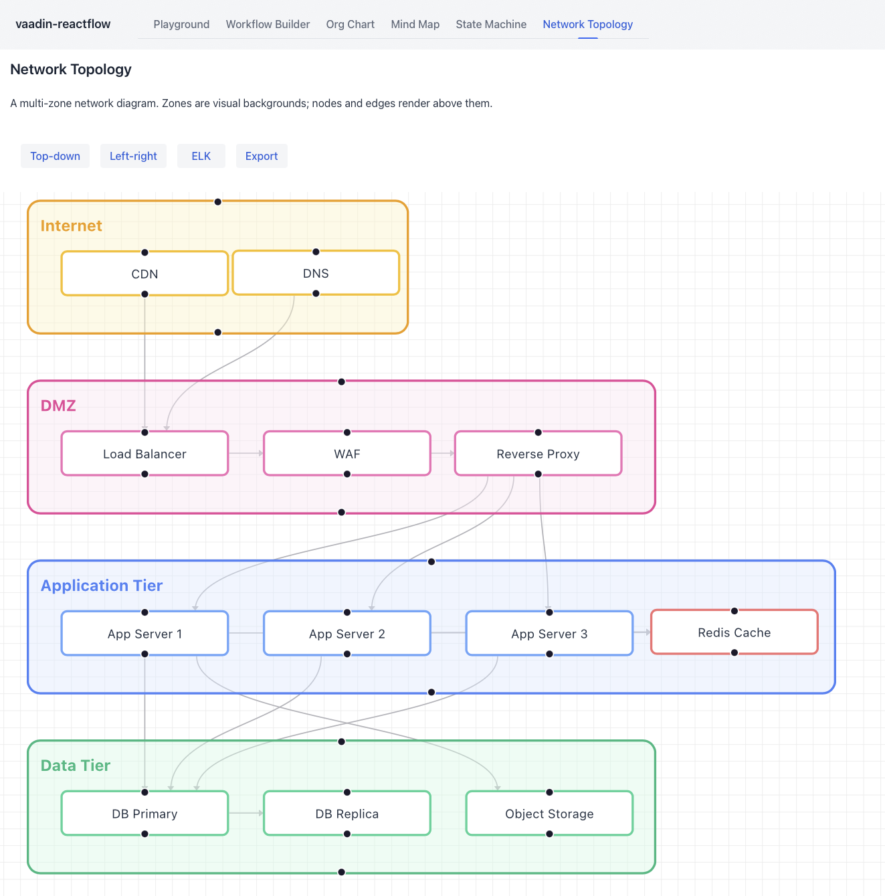
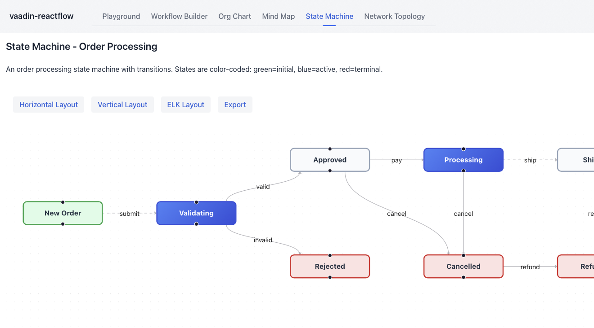
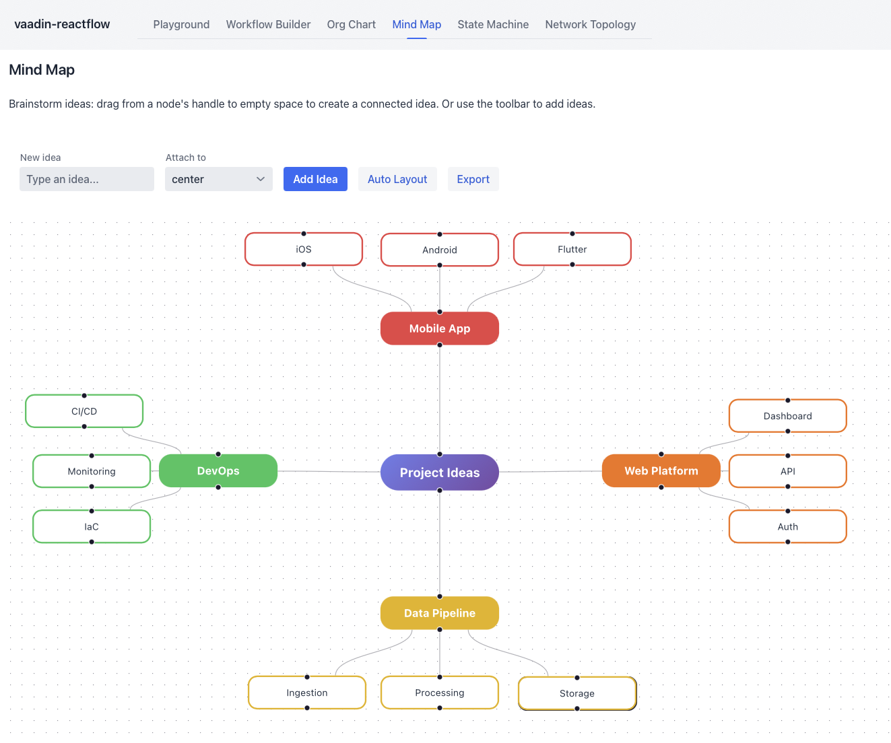

# Vaadin React Flow

[](https://github.com/adumeige/vaadin-reactflow/actions/workflows/ci.yml)

A Vaadin Flow component that embeds [React Flow](https://reactflow.dev/) for building interactive node-based UIs from Kotlin.

## Features

- Server-side Kotlin API for nodes, edges and configuration
- Drag, select, connect and reconnect nodes in the browser
- Built-in controls, minimap, backgrounds and grid snapping
- Floating edges and multi-handle nodes
- Dagre and ELK automatic layouts
- PNG export

## Screenshots






## Quick start

```kotlin
val flow = ReactFlow().apply {
    setWidthFull()
    setHeight("600px")
    setDefaultEdgeType("floating")

    addNodes(listOf(
        ReactFlowNode("start", "input", "Start", 0.0, 0.0),
        ReactFlowNode("process", "default", "Process", 250.0, 0.0),
        ReactFlowNode("done", "output", "Done", 500.0, 0.0),
    ))

    addEdges(listOf(
        ReactFlowEdge("start", "process").withAnimated(true),
        ReactFlowEdge("process", "done").withArrowEnd(),
    ))
}

add(flow)
```

## Run the demo

```bash
mvn -pl demo spring-boot:run
```

Then open http://localhost:8080.

## Modules

- `component` — reusable Vaadin component and React adapter
- `demo` — Spring Boot demo application

## License

See [LICENSE](LICENSE).
