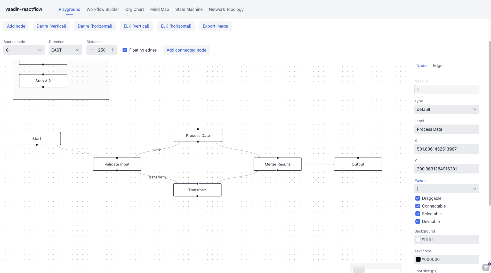
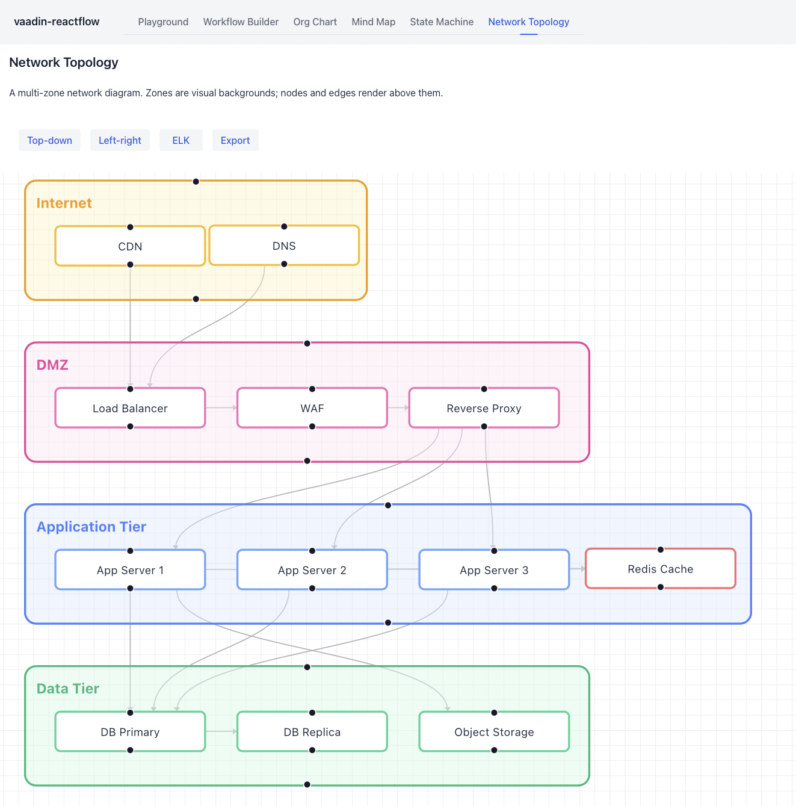
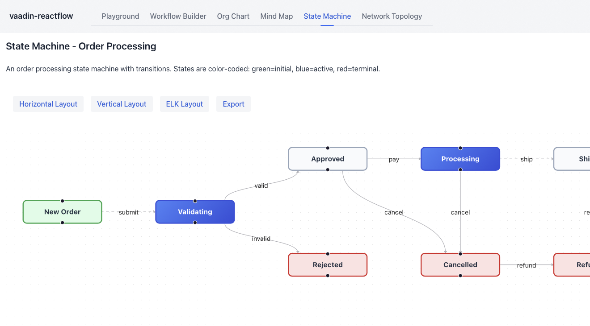
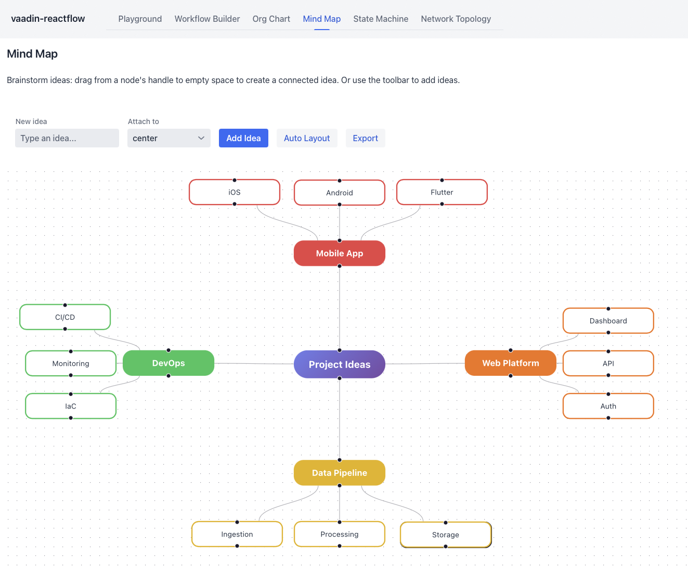

# Vaadin React Flow

[](https://github.com/adumeige/vaadin-reactflow/actions/workflows/ci.yml)

A Vaadin Flow component that embeds [React Flow](https://reactflow.dev/) for building interactive node-based UIs from
Kotlin.

## Features

- Server-side Kotlin API for nodes, edges and configuration
- Drag, select, connect and reconnect nodes in the browser
- Built-in controls, minimap, backgrounds and grid snapping
- Floating edges and multi-handle nodes
- Dagre and ELK automatic layouts
- PNG export

## Screenshots






## Quick start

Add the component as a dependency:

```xml

<dependency>
    <groupId>io.github.adumeige.vaadin-reactflow</groupId>
    <artifactId>vaadin-reactflow-component</artifactId>
    <version>1.0.0</version>
</dependency>
```

Then use the component.

It has not been tested with Java yet, but kotlin interop should work just fine, no dark magic.

```kotlin
val flow = ReactFlow().apply {
    setWidthFull()
    setHeight("600px")
    setDefaultEdgeType("floating")

    addNodes(
        listOf(
            ReactFlowNode("start", "input", "Start", 0.0, 0.0),
            ReactFlowNode("process", "default", "Process", 250.0, 0.0),
            ReactFlowNode("done", "output", "Done", 500.0, 0.0),
        )
    )

    addEdges(
        listOf(
            ReactFlowEdge("start", "process").withAnimated(true),
            ReactFlowEdge("process", "done").withArrowEnd(),
        )
    )
}

add(flow)
```

## Run the demo

```bash
mvn -pl demo spring-boot:run
```

Then open http://localhost:8080.

## Modules

- `component` — reusable Vaadin component and React adapter
- `demo` — Spring Boot demo application

## License

See [LICENSE](LICENSE).


## Maven Central and release migration

The examples target release `1.0.0`. Once published, Maven Central serves the
dependencies without extra repository declarations or credentials.

- Maven group: `io.github.adumeige.vaadin-reactflow`.
- Java/Kotlin package root: `io.github.adumeige.vaadin.reactflow`.
- Library modules: `component`.
- The demo module `demo` is built in CI and excluded from publication.

Consumers must update their dependency group IDs and package imports.
The project keeps its independent parent; it does not need `agentic-parent`
to be published first. Development POMs use `1.0.0-SNAPSHOT`.

Releases are mirrored to [GitHub Packages](https://github.com/adumeige/vaadin-reactflow/packages)
and attached to [GitHub Releases](https://github.com/adumeige/vaadin-reactflow/releases).
GitHub Packages requires authenticated Maven downloads; Central is recommended.

### Publishing

Configure the same four repository Actions secrets used by the other projects:

| Secret | Value |
| --- | --- |
| `CENTRAL_USERNAME` | Sonatype Central Portal token username |
| `CENTRAL_PASSWORD` | Sonatype Central Portal token password |
| `GPG_PRIVATE_KEY` | Full ASCII-armored exported private signing key |
| `GPG_PASSPHRASE` | Signing key passphrase |

The `io.github.adumeige` namespace must be verified in Central, and the public
signing key must be on a supported keyserver such as `keyserver.ubuntu.com`.
GitHub publishing uses the built-in `GITHUB_TOKEN`; no extra token is needed.

1. Merge the release changes into `main` and check that CI passes.
2. Open **Actions → Build and publish Vaadin React Flow → Run workflow**.
3. Select `main` and a new release version, initially `1.0.0`.
4. The workflow creates a versioned POM commit, builds and signs once, and
   automatically publishes to Central. It waits up to an hour for publication;
   no final portal **Publish** click is required.
5. It creates an annotated `v<version>` tag and draft GitHub Release, mirrors and
   verifies the exact signed artifacts in GitHub Packages, attaches downloads,
   and makes the release public with generated notes.

The tag points to the release-version commit; `main` keeps its snapshot version.
Pushes and pull requests verify the reactor and library release archives; they do
not publish. Tags do not trigger publication. Published versions are immutable.
Release artifacts include sources and Dokka API documentation.

### Recover an interrupted release

Central and GitHub publish sequentially. If Central succeeds but the GitHub job
fails, use **Re-run failed jobs** on the same Actions run. Its signed bundle and
release source are retained for 90 days. The mirror skips byte-identical files
already uploaded and rejects conflicting ones. The release remains a draft until
its packages and assets succeed, although the tag may already be visible.

Do not rerun all jobs or start a fresh run for a version already published to
Central. If Central itself fails or times out, inspect the deployment in
[Central Portal](https://central.sonatype.com/publishing/deployments) before recovery:
publication may have continued after the runner stopped. The saved bundle permits
manual recovery without rebuilding.

To verify release artifacts without signing or uploading:

```bash
mvn -Pcentral-release verify -pl '!demo' -Dgpg.skip=true
```

A local `-Pcentral-release deploy` stages for manual approval by default;
the workflow explicitly enables automatic publication.
